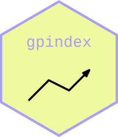

<!-- README.md is generated from README.Rmd. Please edit that file. -->

# Generalized Price and Quantity Indexes <a href="https://marberts.github.io/gpindex/"></a>

<!-- badges: start -->

[](https://cran.r-project.org/package=gpindex)
[](https://marberts.r-universe.dev/gpindex)
[](https://anaconda.org/conda-forge/r-gpindex)
[](https://github.com/marberts/gpindex/actions)
[](https://app.codecov.io/gh/marberts/gpindex)
[](https://zenodo.org/doi/10.5281/zenodo.10097742)
<!-- badges: end -->

Tools to build and work with bilateral generalized-mean price indexes
(and by extension quantity indexes), and indexes composed of
generalized-mean indexes (e.g., superlative quadratic-mean indexes,
GEKS). Covers the core mathematical machinery for making bilateral price
indexes, computing price relatives, detecting outliers, and decomposing
indexes, with wrappers for all common (and many uncommon) index-number
formulas. Implements and extends many of the methods in Balk (2008), von
der Lippe (2007), and the CPI manual (2020).

## Installation

Get the stable release from CRAN.

``` r
install.packages("gpindex")
```

The development version can be installed from R-Universe

``` r
install.packages("gpindex", repos = c("https://marberts.r-universe.dev", "https://cloud.r-project.org"))
```

or directly from GitHub.

``` r
pak::pak("marberts/gpindex")
```

## Usage

``` r
library(gpindex)

# Start with some data on prices and quantities for 6 products
# over 5 periods.
price6
#>   t1  t2  t3  t4  t5
#> 1  1 1.2 1.0 0.8 1.0
#> 2  1 3.0 1.0 0.5 1.0
#> 3  1 1.3 1.5 1.6 1.6
#> 4  1 0.7 0.5 0.3 0.1
#> 5  1 1.4 1.7 1.9 2.0
#> 6  1 0.8 0.6 0.4 0.2
quantity6
#>    t1  t2  t3  t4   t5
#> 1 1.0 0.8 1.0 1.2  0.9
#> 2 1.0 0.9 1.1 1.2  1.2
#> 3 2.0 1.9 1.8 1.9  2.0
#> 4 1.0 1.3 3.0 6.0 12.0
#> 5 4.5 4.7 5.0 5.6  6.5
#> 6 0.5 0.6 0.8 1.3  2.5

# We'll only need prices and quantities for a few periods.
p1 <- price6[[1]]
p2 <- price6[[2]]
p3 <- price6[[3]]
q1 <- price6[[1]]
q2 <- price6[[2]]

# There are functions to calculate all common price indexes,
# like the Laspeyres and Paasche index.
laspeyres_index(p2, p1, q1)
#> [1] 1.4
paasche_index(p2, p1, q2)
#> [1] 1.811905

# The underlying mean functions are also available, as usually
# only price relatives and weights are known.
s1 <- p1 * q1
s2 <- p2 * q2

arithmetic_mean(p2 / p1, s1)
#> [1] 1.4
harmonic_mean(p2 / p1, s2)
#> [1] 1.811905

# The mean representation of a Laspeyres index makes it easy to
# chain by price-updating the weights.
laspeyres_index(p3, p1, q1)
#> [1] 1.05

arithmetic_mean(p2 / p1, s1) *
  arithmetic_mean(p3 / p2, update_weights(p2 / p1, s1))
#> [1] 1.05

# The mean representation of a Paasche index makes it easy to
# calculate percent-change contributions.
harmonic_contributions(p2 / p1, s2)
#> [1]  0.02857143  0.71428571  0.04642857 -0.02500000  0.06666667 -0.01904762

# The ideas are the same for more exotic indexes,
# like the Lloyd-Moulton index.

# Let's start by making some functions for the Lloyd-Moulton index
# when the elasticity of substitution is -1 (an output index).
lloyd_moulton <- lm_index(-1)
quadratic_mean <- generalized_mean(2)
quadratic_update <- factor_weights(2)
quadratic_contributions <- contributions(2)

# This index can be calculated as a mean of price relatives.
lloyd_moulton(p2, p1, q1)
#> [1] 1.592692
quadratic_mean(p2 / p1, s1)
#> [1] 1.592692

# Chained over time
lloyd_moulton(p3, p1, q1)
#> [1] 1.136515
quadratic_mean(p2 / p1, s1) *
  quadratic_mean(p3 / p2, quadratic_update(p2 / p1, s1))
#> [1] 1.136515

# And decomposed to get the contributions of each relative.
quadratic_contributions(p2 / p1, s1)
#> [1]  0.03110568  0.51154526  0.04832926 -0.03830484  0.06666667 -0.02665039
```

## Prior work

There are a number of R packages on the CRAN that implement the standard
index-number formulas (e.g., **IndexNumber**, **productivity**,
**IndexNumR**, **micEconIndex**, **PriceIndices**). While there is
support for a large number of index-number formulas out-of-the box in
this package, the focus is on the tools to easily make and work with any
type of generalized-mean price index. Consequently, compared to existing
packages, this package is suitable for building custom price/quantity
indexes, calculating indexes with sample data, decomposing indexes, and
learning about or researching different types of index-number formulas.

## References

Balk, B. M. (2008). *Price and Quantity Index Numbers*. Cambridge
University Press.

IMF, ILO, Eurostat, UNECE, OECD, and World Bank. (2020). *Consumer Price
Index Manual: Concepts and Methods*. International Monetary Fund.

von der Lippe, P. (2007). *Index Theory and Price Statistics*. Peter
Lang.
